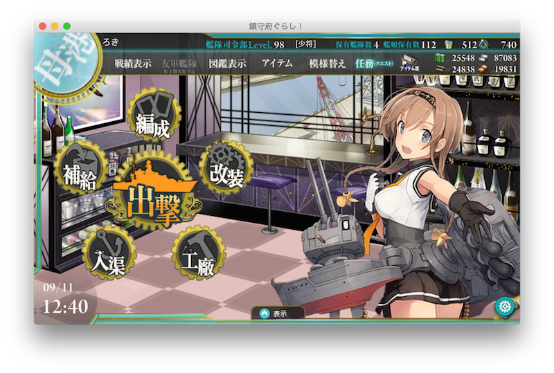

# 鎮守府ぐらし！ - KanColleElectron - 
Electron製のMac用の艦これブラウザです。

## Features
* OS X El Capitan 10.11.6 で動作確認
* ゲーム画面のみのウィンドウ表示
* スクリーンショット機能
* 音量消音ON/OFF機能
* 常に最前面にウィンドウを置く機能
* スクリーンショットのTwitter投稿

## Image


## Installation
Google Chromeのインストール（PepperFlashを使います）

```
brew cask install google-chrome
```


## Download
もうちょっとまって

## Note
このアプリケーションを利用して起きた障害、BANなどについては自己責任でお願いします。
ブラウザ上にゲーム画面を表示させているだけなので特にBANされる理由もなさそうですが。

## License
[MIT](./LICENSE)

Copyright (c) 2015-2016 @roamer7038 
